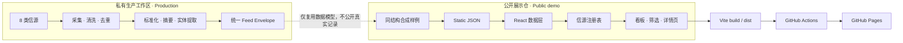

# Game Industry Intelligence Radar

> 全球游戏行业情报雷达 · A portfolio project for multi-source game industry intelligence.

[](https://nodejs.org/)
[](https://react.dev/)
[](https://github.com/demurge-philia093/game-industry-intelligence-radar/actions/workflows/deploy-pages.yml)

将分散的游戏行业信号统一成可检索、可比较、可扩展的情报流。项目重点展示从多源数据建模、产品信息架构到静态站点交付的完整链路。

> **Live Demo** — 待首次 GitHub Pages 部署后补充。预计地址：`https://demurge-philia093.github.io/game-industry-intelligence-radar/`

## 界面预览 / Preview


> 本地生产构建实拍，画面只包含本仓库的合成演示数据。

## 项目价值 / Why it matters

- **统一视图**：将 8 类异构信源归一为同一份 Feed Envelope，支持统一排序、标签、实体关联与详情呈现。
- **快速观察**：用“最新演示”批次、信源分类和内容详情，展示如何从日常噪声中定位值得追踪的信号。
- **可扩展架构**：信源注册表将通用展示与类型特有的 payload / 详情视图分离，便于增加新信源。
- **可复现交付**：公开版无需后端或私密凭据，可在本地构建，并通过 GitHub Actions 部署到 Pages。

## 架构 / Architecture



### 八类信源 / Eight source types

| 类型 | Key | 观察信号 |
| --- | --- | --- |
| 播客 | `podcast` | 从业者对话、长音频内容 |
| 新闻 | `news` | 公司、产品与市场动态 |
| 公众号 | `wechat` | 中文游戏行业观察 |
| 版号 | `banhao` | 游戏审批与发行信号 |
| 工商档案 | `entity` | 公司基本资料与关联实体 |
| 工商变更 | `entity_change` | 主体信息变化 |
| 商标 | `trademark` | IP、品牌与产品布局线索 |
| 招聘 | `recruitment` | 团队扩张、技术方向与项目节奏 |

## 数据说明 / Data statement

私有生产工作区在本公开版创建时累计 **5,115 条**真实记录。为了遵守隐私、平台条款与内容版权边界，本仓库 **不是生产数据库的抽样或镜像**：公开版只保留相同的类型结构，并使用专为演示创建的合成样例。

这个取舍让访问者能验证产品交互、类型系统和工程交付，同时不暴露用户信息、原文全文、商业平台数据、内部状态或 API 凭据。

## 技术栈 / Tech stack

- **Frontend**: React 19, TypeScript, React Router (`HashRouter`)
- **UI**: Tailwind CSS 4, Lucide React, Inter / Fraunces variable fonts
- **Data model**: 通用 Feed Envelope + 按信源区分的 typed payload
- **Build**: Vite 8, TypeScript project references
- **Delivery**: GitHub Actions, GitHub Pages

## 本地运行 / Run locally

需要 [Node.js 22](https://nodejs.org/) 和 npm。公开演示版不需要 `.env` 或外部数据服务。

```bash
git clone https://github.com/demurge-philia093/game-industry-intelligence-radar.git
cd game-industry-intelligence-radar
npm ci
npm run dev
```

命令行会显示本地访问地址（Vite 默认为 `http://localhost:5173`）。

验证生产构建：

```bash
npm run build
npm run preview
```

`npm run build` 会生成 `dist/`；推送到 `main` 后，GitHub Actions 会用同一条构建命令发布该目录。

## 隐私、版权与项目边界 / Scope

| 公开展示仓包含 | 明确不包含 |
| --- | --- |
| 前端交互与响应式看板 | 生产采集器与自动调度 |
| TypeScript 数据模型与信源注册机制 | API Key、Cookie、账号与内部配置 |
| 合成演示数据 | 5,115 条生产记录及原始采集内容 |
| 本地构建与 Pages 部署流程 | 本地管理、转写、扫码等后端能力 |

- 合成样例只用于功能演示，不应视为实时、完整或可供商业决策依赖的行业数据。
- 第三方品牌、作品与平台名称的权利归各自所有者；本仓不提供第三方原文全文或原始数据再分发。
- 本项目是个人作品集项目，与所提及的游戏公司、媒体或数据平台无隶属或背书关系。

## English overview

This portfolio project demonstrates a typed, registry-driven frontend for monitoring eight categories of game-industry signals. The private production workspace contained 5,115 records at the time this public edition was prepared; none of those records are published here. The repository ships only synthetic examples, requires no backend, and is designed for reproducible deployment to GitHub Pages.

## License

开源许可证尚未选定（license to be selected）。在正式添加 `LICENSE` 前，请不要将“代码可公开查看”理解为已授予复制、修改或再分发权。
