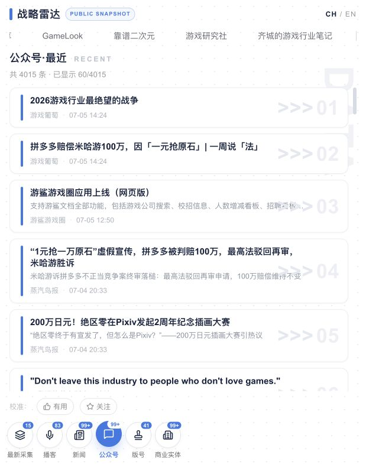
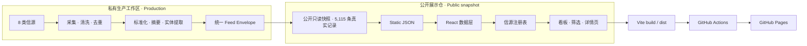

# Game Industry Intelligence Radar

> 全球游戏行业情报雷达 · A portfolio project for multi-source game industry intelligence.

[](https://nodejs.org/)
[](https://react.dev/)
[](https://github.com/demurge-philia093/game-industry-intelligence-radar/actions/workflows/deploy-pages.yml)

将分散的游戏行业信号统一成可检索、可比较、可扩展的情报流。项目重点展示从多源数据建模、产品信息架构到静态站点交付的完整链路。

> **Live Demo** — [打开全球游戏行业战略雷达](https://demurge-philia093.github.io/game-industry-intelligence-radar/)

## 界面预览 / Preview



> 本地生产构建实拍，画面展示本仓库发布的真实采集快照。

## 项目价值 / Why it matters

- **统一视图**：将 8 类异构信源归一为同一份 Feed Envelope，支持统一排序、标签、实体关联与详情呈现。
- **快速观察**：用“最新采集”批次、信源分类和内容详情，展示如何从日常噪声中定位值得追踪的信号。
- **可扩展架构**：信源注册表将通用展示与类型特有的 payload / 详情视图分离，便于增加新信源。
- **可复现交付**：公开版无需后端或私密凭据，可在本地构建，并通过 GitHub Actions 部署到 Pages。

## 架构 / Architecture



### 八类信源 / Eight source types

| 类型 | Key | 观察信号 |
| --- | --- | --- |
| 播客 | `podcast` | 从业者对话、长音频内容 |
| 新闻 | `news` | 公司、产品与市场动态 |
| 公众号 | `wechat` | 中文游戏行业观察 |
| 版号 | `banhao` | 游戏审批与发行信号 |
| 工商档案 | `entity` | 公司基本资料与关联实体 |
| 工商变更 | `entity_change` | 主体信息变化 |
| 商标 | `trademark` | IP、品牌与产品布局线索 |
| 招聘 | `recruitment` | 团队扩张、技术方向与项目节奏 |

## 数据说明 / Data statement

本仓库发布的是生产工作区在 **2026-07-09** 导出的真实只读快照，共 **5,115 条**记录，时间范围从 2012-02-13 至 2026-07-09。标题、来源、发布日期、摘要、正文（源数据已收录时）和原始来源链接均来自实际采集结果，不是占位或合成内容。

公开导出仅移除了内部 `raw_ref`、个人关注词、转写任务状态和一条无效的本地占位音频路径；生产采集器、调度状态、Cookie、API 凭据及本机配置仍不进入公开仓。公开页面是历史快照，不会自动同步本地后续采集结果，也不应当作实时行业数据库。

| 类型 | 记录数 |
| --- | ---: |
| 公众号 `wechat` | 4,015 |
| 新闻 `news` | 856 |
| 播客 `podcast` | 83 |
| 版号 `banhao` | 41 |
| 工商档案 `entity` | 30 |
| 工商变更 `entity_change` | 30 |
| 商标 `trademark` | 30 |
| 招聘 `recruitment` | 30 |

## 技术栈 / Tech stack

- **Frontend**: React 19, TypeScript, React Router (`HashRouter`)
- **UI**: Tailwind CSS 4, Lucide React, Inter / Fraunces variable fonts
- **Data model**: 通用 Feed Envelope + 按信源区分的 typed payload
- **Build**: Vite 8, TypeScript project references
- **Delivery**: GitHub Actions, GitHub Pages

## 本地运行 / Run locally

需要 [Node.js 22](https://nodejs.org/) 和 npm。公开快照版不需要 `.env` 或外部数据服务。首页先读取约 3.2 MB 的全量索引；44 MB 详情数据被拆为 64 个静态分片，仅在打开具体记录时按需加载。

```bash
git clone https://github.com/demurge-philia093/game-industry-intelligence-radar.git
cd game-industry-intelligence-radar
npm ci
npm run dev
```

命令行会显示本地访问地址（Vite 默认为 `http://localhost:5173`）。

验证生产构建：

```bash
npm run verify:snapshot
npm run build
npm run preview
```

`npm run verify:snapshot` 会核对 5,115 条索引与详情分片一一对应，并阻止内部字段、联系方式或凭据样式进入部署。`npm run build` 会生成 `dist/`；推送到 `main` 后，GitHub Actions 会先执行快照校验，再发布该目录。

维护者需要从私有生产工作区刷新公开快照时，运行：

```bash
npm run export:public-snapshot -- \
  /absolute/path/to/feed.json \
  public/data/feed.json \
  /absolute/path/to/content_filter.json \
  public/data/content_filter.json
```

导出器会保留真实记录，重新生成全量索引和 64 个详情分片，同时清除内部引用、私人关注词、任务状态、联系方式与敏感 URL 参数。

## 隐私、版权与项目边界 / Scope

| 公开展示仓包含 | 明确不包含 |
| --- | --- |
| 前端交互与响应式看板 | 生产采集器与自动调度 |
| TypeScript 数据模型与信源注册机制 | API Key、Cookie、账号与内部配置 |
| 5,115 条真实采集快照及来源链接 | 内部原始文件路径、关注词与任务状态 |
| 本地构建与 Pages 部署流程 | 本地管理、转写、扫码等后端能力 |

- 数据是截至 2026-07-09 的历史快照，不应视为实时、完整或可供商业决策依赖的行业数据。
- 第三方品牌、作品、媒体内容与平台名称的权利归各自权利人；原始来源链接用于溯源与归属说明。
- 本项目是个人作品集项目，与所提及的游戏公司、媒体或数据平台无隶属或背书关系。

## English overview

This portfolio project demonstrates a typed, registry-driven frontend for monitoring eight categories of game-industry signals. It publishes a read-only snapshot of 5,115 real collected records through 2026-07-09, with source attribution links where available. Internal paths, private monitoring terms, task state and credentials are excluded. The snapshot requires no backend and is deployed reproducibly through GitHub Pages.

## License

开源许可证尚未选定（license to be selected）。在正式添加 `LICENSE` 前，请不要将“代码可公开查看”理解为已授予复制、修改或再分发权。
